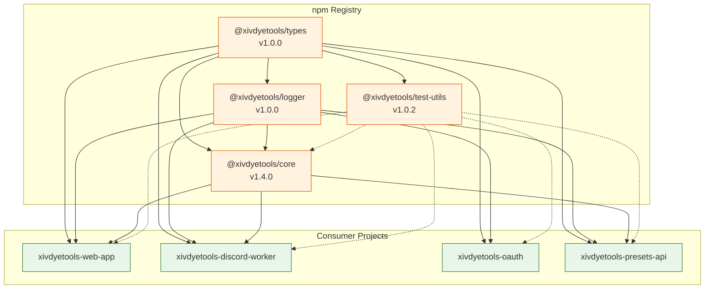

# Dependency Graph

**Package dependencies and consumption relationships across the XIV Dye Tools ecosystem**

---

## npm Package Dependencies



---

## Dependency Matrix

### Shared Packages

| Package | Depends On | Used By |
|---------|------------|---------|
| **@xivdyetools/types** | — | All projects |
| **@xivdyetools/logger** | @xivdyetools/types | All projects |
| **@xivdyetools/test-utils** | @xivdyetools/types | All projects (devDependency) |
| **@xivdyetools/core** | @xivdyetools/types, @xivdyetools/logger | web-app, discord-worker, presets-api |

### Consumer Applications

| Project | Runtime Dependencies | Test Dependencies |
|---------|----------------------|-------------------|
| **xivdyetools-web-app** | @xivdyetools/core, @xivdyetools/types, @xivdyetools/logger, lit, vite | @xivdyetools/test-utils, vitest, playwright |
| **xivdyetools-discord-worker** | @xivdyetools/core, @xivdyetools/types, @xivdyetools/logger, hono, discord-interactions, @resvg/resvg-wasm, @cf-wasm/photon | @xivdyetools/test-utils, vitest |
| **xivdyetools-oauth** | @xivdyetools/types, @xivdyetools/logger, hono | @xivdyetools/test-utils, vitest |
| **xivdyetools-presets-api** | @xivdyetools/types, @xivdyetools/logger, hono | @xivdyetools/test-utils, vitest |

---

## Core Library Internal Structure

```
@xivdyetools/core
├── services/
│   ├── ColorService.ts      ← ColorConverter, ColorAccessibility, ColorManipulator
│   ├── DyeService.ts        ← DyeDatabase (k-d tree), DyeSearch, HarmonyGenerator
│   ├── APIService.ts        ← Universalis API wrapper with pluggable cache
│   ├── PaletteService.ts    ← K-means++ clustering algorithm
│   ├── PresetService.ts     ← Curated preset palettes
│   └── LocalizationService.ts
├── data/
│   └── dyes.json            ← 136 official FFXIV dyes
├── types/
│   └── (re-exports from @xivdyetools/types)
└── locales/
    └── {en,ja,de,fr,ko,zh}.json
```

---

## Third-Party Dependencies by Project

### xivdyetools-web-app

| Package | Version | Purpose |
|---------|---------|---------|
| `lit` | ^3.x | Web components framework |
| `vite` | ^5.x | Build tool and dev server |
| `tailwindcss` | ^3.x | Utility-first CSS |
| `@tailwindcss/forms` | ^0.5 | Form styling plugin |

### xivdyetools-discord-worker

| Package | Version | Purpose |
|---------|---------|---------|
| `hono` | ^4.6 | HTTP framework for Workers |
| `discord-interactions` | ^3.x | Ed25519 signature verification |
| `@resvg/resvg-wasm` | ^2.x | SVG to PNG rendering |
| `@cf-wasm/photon` | ^0.x | Image processing (dominant color) |

### xivdyetools-oauth

| Package | Version | Purpose |
|---------|---------|---------|
| `hono` | ^4.6 | HTTP framework for Workers |

### xivdyetools-presets-api

| Package | Version | Purpose |
|---------|---------|---------|
| `hono` | ^4.6 | HTTP framework for Workers |

---

## Version Synchronization

When updating **@xivdyetools/core**:

1. Update version in `xivdyetools-core/package.json`
2. Run `npm publish`
3. Update dependency in each consumer:
   ```bash
   cd xivdyetools-web-app && npm update @xivdyetools/core
   cd xivdyetools-discord-worker && npm update @xivdyetools/core
   cd xivdyetools-presets-api && npm update @xivdyetools/core
   ```
4. Run tests in all consumers to verify compatibility
5. Deploy updated consumers

### Breaking Change Protocol

If a core library change is breaking:

1. Increment major version (e.g., 1.4.0 → 2.0.0)
2. Update consumers to handle breaking changes
3. Update minimum version in compatibility matrix ([versions.md](../versions.md))

---

## Related Documentation

- [Service Bindings](service-bindings.md) - Worker-to-worker communication
- [API Contracts](api-contracts.md) - Inter-service API specifications
- [Versions](../versions.md) - Current version matrix
