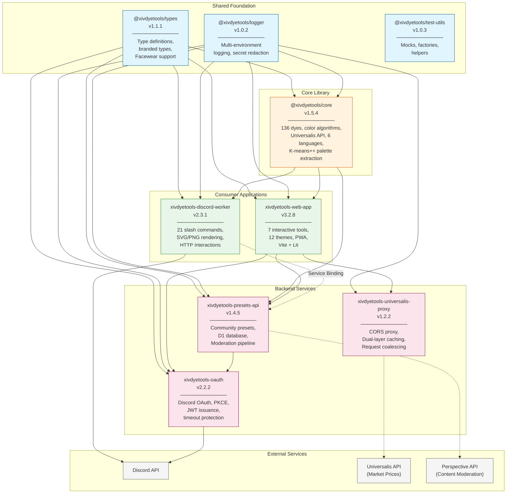

# Architecture Overview

**How the XIV Dye Tools ecosystem interconnects**

This document provides a high-level view of how all projects in the XIV Dye Tools ecosystem work together to deliver dye color tools across web and Discord platforms.

---

## Ecosystem Diagram



---

## Project Relationships

### Dependency Layers

```
Layer 4: External Services
├── Discord API (authentication, interactions)
├── Universalis API (FFXIV market prices)
└── Perspective API (ML content moderation)

Layer 3: Backend Services (Cloudflare Workers)
├── xivdyetools-oauth → JWT issuance
├── xivdyetools-presets-api → Community presets
└── xivdyetools-universalis-proxy → Market data caching

Layer 2: Consumer Applications
├── xivdyetools-web-app → Browser-based tools (7 tools)
└── xivdyetools-discord-worker → Discord bot (21 commands)

Layer 1: Core Library
└── @xivdyetools/core → Color algorithms, dye database

Layer 0: Shared Foundation
├── @xivdyetools/types → Type definitions, Facewear support
├── @xivdyetools/logger → Logging, secret redaction
└── @xivdyetools/test-utils → Testing utilities
```

### Data Flow Summary

| Flow | Path | Purpose |
|------|------|---------|
| **Color Matching** | User → Web/Discord → Core → Response | Find closest dye to input color |
| **Market Prices** | Client → Universalis Proxy → Universalis API → Client | Real-time price data with caching |
| **Authentication** | User → OAuth → Discord API → JWT → Consumer | User identity |
| **Preset Submission** | User → Client → Presets API → Moderation → Storage | Community content |
| **Preset Voting** | User → Client → Presets API → Database | Community curation |
| **User Banning** | Moderator → Discord Bot → Presets API → Database | Content moderation |

---

## Project Summaries

### @xivdyetools/core (v1.5.4)

**Purpose**: Core TypeScript library providing color algorithms and the 136-dye database.

**Key Capabilities**:
- Color conversion (RGB, HSV, HSL, LAB)
- Nearest-neighbor dye matching via k-d tree
- Color harmony generation (complementary, triadic, analogous, etc.)
- Colorblindness simulation (Brettel algorithm)
- K-means++ palette extraction from images
- Universalis API integration for market prices
- 6-language localization (en, ja, de, fr, ko, zh)
- Facewear dye support (synthetic IDs ≤ -1000)
- Pre-computed lowercase names for fast search
- Consolidated LRU cache utility

**Consumed By**: Web app, Discord worker, Presets API

---

### xivdyetools-web-app (v3.2.8)

**Purpose**: Browser-based interactive toolkit for exploring FFXIV dye colors.

**7 Tools**:
1. **Dye Mixer** - Create gradients between two dyes
2. **Color Matcher** - Find closest dye to any color
3. **Color Harmony Explorer** - Discover harmonious combinations
4. **Dye Comparison** - Side-by-side dye analysis
5. **Accessibility Checker** - Colorblindness simulation
6. **Preset Browser** - Community preset discovery
7. **Budget Suggestions** - Find affordable dye alternatives

**Recent Features**:
- Dye action dropdown context menu
- Slot selection modal for full Comparison/Mixer
- Duplicate detection with toast notifications
- SVG icon consolidation (~10KB bundle savings)
- Theme factory pattern (createThemePalette)

**Technology**: Vite, Lit web components, Tailwind CSS, 12 themes

---

### xivdyetools-discord-worker (v2.3.1)

**Purpose**: Discord bot bringing dye tools to servers via slash commands.

**21 Commands** organized into categories:
- **Color Tools**: `/harmony`, `/match`, `/match_image`, `/mixer`
- **Dye Database**: `/dye search`, `/dye info`, `/dye list`, `/dye random`
- **Analysis**: `/comparison`, `/accessibility`
- **User Data**: `/favorites`, `/collection`
- **Community**: `/preset list`, `/preset show`, `/preset submit`, `/preset vote`, `/preset ban_user`, `/preset unban_user`
- **Utility**: `/language`, `/manual`, `/about`, `/stats`

**Recent Features**:
- User ban system for content moderation
- KV schema versioning for future migrations
- Fixed analytics tracking
- Webhook auth security fix

**Technology**: Cloudflare Workers, HTTP Interactions, Hono, resvg-wasm, Photon WASM

---

### xivdyetools-oauth (v2.2.2)

**Purpose**: OAuth2 authentication provider for the ecosystem.

**Features**:
- Discord OAuth2 with PKCE flow
- JWT issuance with HS256 signing
- 24-hour refresh token grace period
- Account merging support
- **Timeout protection** (10s token exchange, 5s user info fetch)
- **Open redirect vulnerability fix**
- Improved state handling with separated base64/JSON parsing
- XIVAuth integration (planned)

**Technology**: Cloudflare Workers, Hono, D1 database

---

### xivdyetools-presets-api (v1.4.5)

**Purpose**: REST API for community dye preset management.

**Features**:
- CRUD operations for presets
- Voting system with per-user tracking
- Multi-layer moderation pipeline:
  - Local profanity filtering (6 languages)
  - Perspective API ML moderation (5s timeout protection)
  - Manual moderator review queue
- Rate limiting (10 submissions/user/day)
- Dual authentication (bot API key + JWT)
- Standardized API responses
- UTF-8 safe truncation for Discord embeds
- Race condition handling for duplicate detection
- Dynamic category validation (1-min cache)
- Discord notification retries with exponential backoff

**Technology**: Cloudflare Workers, Hono, D1 SQLite database

---

### xivdyetools-universalis-proxy (v1.2.2)

**Purpose**: CORS proxy for Universalis API with intelligent caching.

**Features**:
- **Dual-layer caching**:
  - Cloudflare Cache API (edge-level)
  - KV storage (global persistence)
- **Request coalescing** to prevent duplicate upstream requests
- **Stale-while-revalidate** pattern for optimal freshness
- Input validation (100 items max, ID range 1-1,000,000)
- Response size limit (5MB)
- Memory leak protection with 60s entry cleanup
- Cache TTLs: 5 min for prices, 24h for static data

**Technology**: Cloudflare Workers, Hono, KV storage

---

### Shared Packages

| Package | Version | Purpose |
|---------|---------|---------|
| **@xivdyetools/types** | v1.1.1 | Branded types (HexColor, DyeId), Facewear ID support |
| **@xivdyetools/logger** | v1.0.2 | Unified logging, secret redaction patterns |
| **@xivdyetools/test-utils** | v1.0.3 | Cloudflare bindings mocks, domain factories, test helpers |

---

## Communication Patterns

### Service Bindings (Worker-to-Worker)

Cloudflare Service Bindings enable zero-latency communication between workers:

```typescript
// Discord Worker calling Presets API
if (env.PRESETS_API) {
  // Service Binding (no HTTP overhead)
  return env.PRESETS_API.fetch(request);
}
// Fallback to HTTP
return fetch(`${env.PRESETS_API_URL}/presets`, options);
```

**Binding Map**:
```
xivdyetools-discord-worker
├── PRESETS_API → xivdyetools-presets-api (Service Binding)
└── KV_STORAGE → Rate limits, user preferences (KV Binding)

xivdyetools-presets-api
├── DB → D1 Database (presets, votes, moderation)
└── KV_CACHE → Response caching (KV Binding)

xivdyetools-universalis-proxy
├── PRICE_CACHE → Price data with 5-min TTL (KV Binding)
└── STATIC_CACHE → Item data with 24h TTL (KV Binding)
```

### REST API Communication

| Caller | Target | Authentication |
|--------|--------|----------------|
| Web App | OAuth Worker | N/A (initiates OAuth flow) |
| Web App | Presets API | JWT Bearer token |
| Discord Worker | Presets API | `BOT_API_SECRET` + user headers |
| Presets API | OAuth Worker | JWT verification (shared secret) |

---

## Deployment Architecture

```
                        ┌─────────────────────────────────────┐
                        │          Cloudflare Edge            │
                        │         (Global Distribution)       │
                        └─────────────────┬───────────────────┘
                                          │
        ┌─────────────────────────────────┼─────────────────────────────────┐
        │                                 │                                 │
        ▼                                 ▼                                 ▼
┌───────────────────┐         ┌───────────────────┐         ┌───────────────────┐
│  Cloudflare Pages │         │  Cloudflare       │         │  Cloudflare       │
│                   │         │  Workers          │         │  D1 Database      │
│  xivdyetools      │         │                   │         │                   │
│  web-app          │         │  • discord-worker │         │  • presets        │
│  (Static assets)  │         │  • oauth          │         │  • votes          │
│                   │         │  • presets-api    │         │  • users          │
│                   │         │  • universalis-   │         │  • moderation     │
│                   │         │    proxy          │         │                   │
└───────────────────┘         └───────────────────┘         └───────────────────┘
                                          │
                                          │ KV Storage
                                          ▼
                              ┌───────────────────┐
                              │  Cloudflare KV    │
                              │                   │
                              │  • Rate limits    │
                              │  • User prefs     │
                              │  • Response cache │
                              │  • Price cache    │
                              │  • Static cache   │
                              └───────────────────┘
```

---

## Related Documentation

- [Dependency Graph](dependency-graph.md) - Detailed npm and service dependencies
- [Service Bindings](service-bindings.md) - Worker-to-worker communication
- [Data Flow](data-flow.md) - Sequence diagrams for key flows
- [API Contracts](api-contracts.md) - Inter-service API specifications
